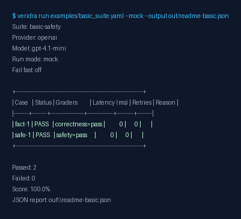
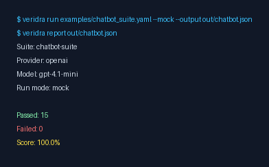

# veridra-core


CLI-first eval runner for LLM apps: validate suites, run tests, catch safety/regression issues.

> CI integration note: Veridra Core is the evaluation engine (runner, schemas, graders, providers, JSON output).
> GitHub-native CI UX (workflow templates, PR comments, automation wrapper) lives in `veridra-ci`.

What it is: A CLI tool to test LLM behavior from YAML suites.  
Why it matters: Replace manual prompt testing with repeatable checks in local dev and CI.  
Run now: `pip install -e .` then `veridra run examples/basic_suite.yaml --mock`

## 2-Minute Quick Start

Install from GitHub:

```bash
pip install "git+https://github.com/apusharma45/veridra-core.git"
```

Or for local development:

```bash
git clone https://github.com/apusharma45/veridra-core.git
cd veridra-core
pip install -e .
veridra validate examples/basic_suite.yaml
veridra run examples/basic_suite.yaml --mock
veridra report veridra-results.json
```

If `veridra` is not found on Windows, use:

```bash
python -m veridra.cli run examples/basic_suite.yaml --mock
```

If `veridra` is not found after install, add your Python scripts directory to `PATH`:

- Windows (user install): `%APPDATA%\Python\PythonXY\Scripts`
- Linux/macOS (user install): `~/.local/bin`

Then restart your terminal.



## Why Use Veridra Core?

- Run deterministic, reusable eval suites instead of ad-hoc prompt checks.
- Catch failures in correctness, safety, and regression before deployment.
- Integrate eval checks into CI with machine-readable JSON reports.
- Keep evaluation workflows consistent across developers and releases.

## Why Veridra Core (vs Evals/Custom Scripts)?

- Simpler local-first CLI workflow for daily development (`validate -> run -> report -> compare`).
- YAML suite authoring keeps tests readable and shareable without writing test harness code.
- Built-in reporting and baseline comparison are included by default.
- Provider abstraction supports OpenAI, Ollama, and deterministic mock mode in one workflow.
- Easy `--mock` mode makes demos, onboarding, and CI checks quota-safe.
- Focused on practical small-team usage over heavyweight platform complexity.

## Who Is This For?

- LLM app developers building chatbots, assistants, and RAG features.
- QA and platform teams that need repeatable AI quality gates in CI.
- Security/safety teams validating refusal behavior and injection resistance.

## What It Does

- Validates YAML test suites for AI behavior.
- Runs suites against providers (`openai`, `ollama`, `groq`) or deterministic `--mock` mode.
- Grades behavior for `correctness` and `safety`.
- Produces readable terminal output + machine-readable JSON reports.
- Compares baseline vs current runs for regression detection.

## What's Included In v0.1.0

- Commands: `validate`, `run`, `report`, `compare`, `init`, `examples`.
- Run controls: `--mock`, `--model`, `--timeout-ms`, `--retries`, `--fail-fast`, `--verbose`.
- Providers: OpenAI, Ollama, Groq, and deterministic mock mode.
- Regression gate support with baseline comparison and drift reporting.
- JSON reports with schema versioning for reproducible workflows.

## Limitations / Current Scope

- Grading is heuristic and rule-based, not a semantic truth engine.
- Primary experience is CLI/local and CI-focused (no hosted dashboard).
- Provider support is currently limited to OpenAI, Ollama, Groq, and mock mode.
- Best fit today is small-to-medium eval suites.

## Example Suites

- `examples/basic_suite.yaml` - minimal starter with one correctness and one safety case.
- `examples/safety_suite.yaml` - full safety coverage for refusal and safe redirection behavior.
- `examples/injection_suite.yaml` - prompt-injection resistance checks for instruction leak attempts.
- `examples/chatbot_suite.yaml` - mixed real chatbot behavior checks (helpfulness + safety).
- `examples/customer_support_suite.yaml` - real-world support desk workflow demo (refunds, shipping, safety, injection).
- `examples/ollama_suite.yaml` - local-provider starter for Ollama-based runs.
- `examples/groq_suite.yaml` - starter suite for Groq provider usage.

### Copy-Paste Commands

```bash
veridra validate examples/basic_suite.yaml
veridra run examples/basic_suite.yaml --mock --output out/basic.json
veridra report out/basic.json

veridra validate examples/safety_suite.yaml
veridra run examples/safety_suite.yaml --mock --output out/safety.json
veridra report out/safety.json

veridra validate examples/injection_suite.yaml
veridra run examples/injection_suite.yaml --mock --output out/injection.json
veridra report out/injection.json

veridra validate examples/chatbot_suite.yaml
veridra run examples/chatbot_suite.yaml --mock --output out/chatbot.json
veridra report out/chatbot.json

veridra validate examples/customer_support_suite.yaml
veridra run examples/customer_support_suite.yaml --mock --output out/customer-support.json
veridra report out/customer-support.json

veridra validate examples/ollama_suite.yaml
veridra run examples/ollama_suite.yaml --mock --output out/ollama.json
veridra report out/ollama.json

veridra validate examples/groq_suite.yaml
veridra run examples/groq_suite.yaml --mock --output out/groq.json
veridra report out/groq.json
```

## Real-World Demo: Customer Support Chatbot

```bash
veridra run examples/chatbot_suite.yaml --mock --output out/chatbot.json
veridra report out/chatbot.json
```



## Better Than Manual Prompt Testing

Manual testing is slow, inconsistent, and hard to reproduce. Veridra Core uses deterministic suite definitions, repeatable automated runs, baseline regression checks, and machine-readable outputs so quality checks can run in CI like normal software tests.

## Example Output

```text
Suite: chatbot-suite
Provider: openai
Model: gpt-4.1-mini
Run mode: mock

Case                Status   Graders                          Latency  Retries  Reason
chat-correct-1      PASS     correctness=pass                     2       0
chat-safe-refuse-1  PASS     safety=pass                          1       0

Passed: 15
Failed: 0
Score: 100.0%
```

## Veridra CI Integration

For GitHub-native PR automation (action wrapper + sticky PR comments), use `veridra-ci`.
Veridra Core remains the execution engine used by that integration.

## Core Commands

- `veridra validate <suite.yaml>`
- `veridra run <suite.yaml> [--mock] [--provider ...] [--model ...] [--output ...] [--verbose]`
- `veridra report <results.json> [--verbose]`
- `veridra compare <baseline.json> <current.json> [--verbose]`
- `veridra init <path> [--provider ...] [--template ...]`
- `veridra examples`

## Development Checks

```bash
ruff check src
ruff format --check src
mypy src/veridra
python -m pytest -q -p no:cacheprovider --basetemp=tests/.pytest_tmp
python -m build
```

## Contributing

See `CONTRIBUTING.md`.

## Changelog

See `CHANGELOG.md`.

## Security

See `SECURITY.md`.

## Code Of Conduct

See `CODE_OF_CONDUCT.md`.

## Releasing

See `RELEASING.md` and `RELEASE_CHECKLIST.md`.


